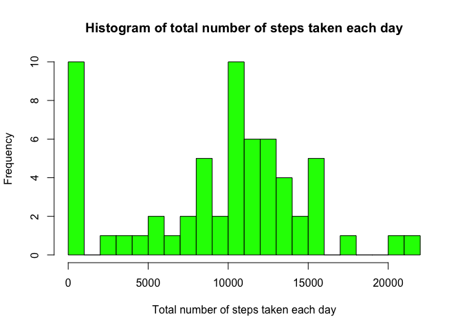
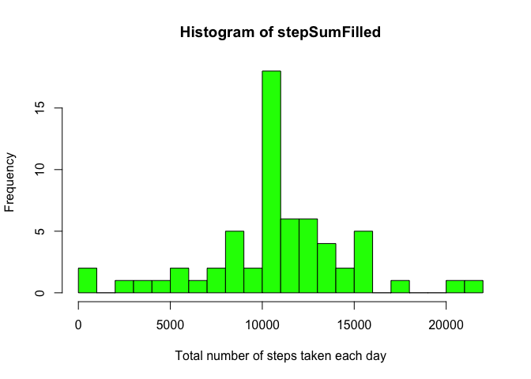
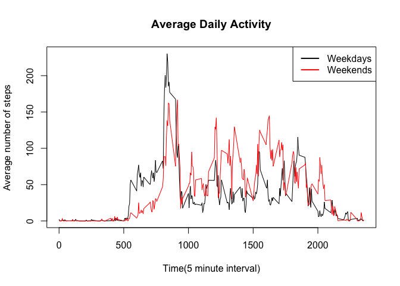

# Reproducible Research: Peer Assessment 1

## Loading and preprocessing the data


```r
if (!file.exists("activity.csv")){
    unzip(zipfile = "activity.zip")
}
data <- read.csv("activity.csv")
summary(data)
```

```
##      steps                date          interval     
##  Min.   :  0.00   2012-10-01:  288   Min.   :   0.0  
##  1st Qu.:  0.00   2012-10-02:  288   1st Qu.: 588.8  
##  Median :  0.00   2012-10-03:  288   Median :1177.5  
##  Mean   : 37.38   2012-10-04:  288   Mean   :1177.5  
##  3rd Qu.: 12.00   2012-10-05:  288   3rd Qu.:1766.2  
##  Max.   :806.00   2012-10-06:  288   Max.   :2355.0  
##  NA's   :2304     (Other)   :15840
```

## What is mean total number of steps taken per day?

* Ignoring the missing values in the dataset, the histogram is plotted

```r
stepSum <- tapply(data$steps, data$date, sum, na.rm = TRUE)
hist(stepSum, breaks = 20, col = "green", main = "Histogram of total number of steps taken each day", xlab = "Total number of steps taken each day")
```

 

* The mean and median total number of steps taken per day are calculated

```r
mean(stepSum)
```

```
## [1] 9354.23
```

```r
median(stepSum)
```

```
## [1] 10395
```

## What is the average daily activity pattern?

* A time series plot (i.e. type = "l") of the 5-minute interval (x-axis) and the average number of steps taken, averaged across all days (y-axis)

```r
stepAvg <- as.numeric(tapply(data$steps, data$interval, mean, na.rm = TRUE))
stepAvg <- data.frame(interval = data$interval[1:length(stepAvg)], average = stepAvg)
plot(stepAvg$interval, stepAvg$average, type = "l", main = "Average Daily Activity", xlab = "Time(5 minute interval)", ylab = "Average number of steps")
```

 

* The maximum number of steps on average across all the days in the dataset is contained in the 5-minute interval of 

```r
stepAvg[which.max(stepAvg$average), 1]
```

```
## [1] 835
```

## Imputing missing values

* The total number of missing values in the dataset is

```r
sum(is.na(data$steps))
```

```
## [1] 2304
```

* We now fill in all of the missing values in the dataset with the the mean for that 5-minute interval.

* Create a new dataset that is equal to the original dataset but with the missing data filled in.

```r
dataFilled <- data
for(i in which(is.na(data$steps))) {
    dataFilled$steps[i] <- stepAvg$average[stepAvg$interval == data$interval[i]]
}
```


* Make a histogram of the total number of steps taken each day and Calculate and report the mean and median total number of steps taken per day.

```r
stepSumFilled <- tapply(dataFilled$steps, dataFilled$date, sum, na.rm = TRUE)
hist(stepSumFilled, breaks = 20, col = "green", xlab = "Total number of steps taken each day")
```

 

```r
mean(stepSumFilled)
```

```
## [1] 10766.19
```

```r
median(stepSumFilled)
```

```
## [1] 10766.19
```

Compared with the estimates from the first part of the assignment, we see that the imput of missing data increases both mean and median on the estimates of the total daily number of steps?

## Are there differences in activity patterns between weekdays and weekends?

* Create a new factor variable in the dataset with two levels -- "weekday" and "weekend" indicating whether a given date is a weekday or weekend day.
* Compared with the average activities, we conclude that the average activity is higher during the time interval 500 ~ 1000 in weekends than that in weekdays and lower in the rest.


```r
dataFilled$date <- as.POSIXct(dataFilled$date)
dataWeekday <- dataFilled[weekdays(dataFilled$date) %in% c("Monday","Tuesday","Wednesday","Thursday","Friday"),]
dataWeekend <- dataFilled[weekdays(dataFilled$date) %in% c("Saturday","Sunday"),]
weekAvg <- data.frame(weekday = as.numeric(tapply(dataWeekday$steps, dataWeekday$interval, mean)), weekend = as.numeric(tapply(dataWeekend$steps, dataWeekend$interval, mean)))
plot(stepAvg$interval, weekAvg$weekday,type="l",col="black",main = "Average Daily Activity", xlab = "Time(5 minute interval)", ylab = "Average number of steps")
lines(stepAvg$interval, weekAvg$weekend,type="l",col="red")
legend("topright",legend=c("Weekdays","Weekends"), col=c("black","red"), bg="white",lwd=2)
```

 
